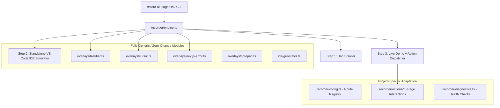

# Autorecording Suite — Project Porting & Integration Guide 🚀

This guide explains how to port and adapt this **3-step automated recording engine** (Official Doc $\rightarrow$ Standalone VS Code $\rightarrow$ Live Demo with interactive Taskbar, Human Cursor, and Error Auto-Capture) into any other project

---

## 🏗️ Architecture & Decoupling

The autorecord suite is designed around modular, plug-and-play layers:



---

## 📦 Step 1: Copying Files & Installation

1. Copy the entire `autorecord/` directory into your new project's root folder:

   ```
   my-new-project/
   ├── backend/
   ├── frontend/
   └── autorecord/
   ```

2. Inside `autorecord/package.json`, verify required dependencies:

   ```json
   {
     "name": "autorecord",
     "version": "1.0.0",
     "scripts": {
       "record": "tsx record-all-pages.ts"
     },
     "dependencies": {
       "playwright": "^1.49.0"
     },
     "devDependencies": {
       "@types/node": "^22.10.0",
       "tsx": "^4.19.0",
       "typescript": "^5.7.0"
     }
   }
   ```

3. Install dependencies and Chromium browser binary:
   ```bash
   cd autorecord
   npm install
   npx playwright install chromium
   ```

---

## ⚙️ Step 2: Adapting to Your Backend & Ports

Different frameworks use different ports and health check endpoints.

### 1. Update `recorder/diagnostics.ts`

Modify the backend/frontend URL targets to match your new project:

```typescript
// autorecord/recorder/diagnostics.ts
const FRONTEND_PORT = 3000;
const BACKEND_PORT = 8000; // Change to 8080, 5000, 3001 etc. if needed

export async function checkServicesHealth(): Promise<{
  frontend: boolean;
  backend: boolean;
}> {
  // Check Frontend (e.g. Next.js / Vite / Remix)
  const frontendOk = await checkPort(`http://localhost:${FRONTEND_PORT}`);

  // Check Backend (e.g. FastAPI / LangGraph / Express / AgentOS)
  const backendOk =
    (await checkPort(`http://localhost:${BACKEND_PORT}/health`)) ||
    (await checkPort(`http://localhost:${BACKEND_PORT}/api/copilotkit`));

  return { frontend: frontendOk, backend: backendOk };
}
```

---

## 📋 Step 3: Registering Routes in `recorder/config.ts`

`recorder/config.ts` is the single source of truth for all recorded pages. Define each page with:

- `id`: Unique CLI identifier (used with `--page=<id>`).
- `title`: Clean feature title.
- `docUrl`: Official documentation link for Step 1.
- `demoUrl`: Local demo URL for Step 3 (`http://localhost:3000/...`).
- `ideFile`: Target source code file to highlight in Step 2.
- `startLine` & `endLine`: Snippet line range highlighted in VS Code.
- `actionType`: Name of the custom action handler (or `'chat'` for standard input).
- `waitAfterPromptMs`: Streaming wait time (increase for slower multi-agent LLM chains).

### Example Configuration:

```typescript
// autorecord/recorder/config.ts
export const PAGES_CONFIG: PageConfig[] = [
  {
    id: "quickstart",
    title: "Quickstart Chat",
    docUrl: "https://docs.yourproject.com/quickstart",
    demoUrl: "http://localhost:3000/quickstart/demo-chat",
    ideFile: "frontend/src/app/quickstart/demo-chat/page.tsx",
    startLine: 18,
    endLine: 28,
    actionType: "chat",
    prompt: "Hello! Can you assist me with this task?",
    waitAfterPromptMs: 6000, // Increase for complex agent workflows
  },
  {
    id: "custom-tool",
    title: "Custom Agent Tool",
    docUrl: "https://docs.yourproject.com/tools",
    demoUrl: "http://localhost:3000/tools/demo-chat",
    ideFile: "frontend/src/app/tools/page.tsx",
    startLine: 35,
    endLine: 50,
    actionType: "custom-tool",
    prompt: "Check stock prices",
    waitAfterPromptMs: 8000,
  },
];
```

---

## 🖱️ Step 4: Writing Custom Action Handlers

If a page only needs a prompt typed into chat, set `actionType: 'chat'` and the default runner handles it automatically.

For interactive UI (button clicks, dropdowns, tabs, HITL confirmations):

1. Create a new handler in `recorder/actions/<name>.action.ts`:

   ```typescript
   // autorecord/recorder/actions/custom-tool.action.ts
   import { type Page } from "playwright";
   import { type PageConfig } from "../types";
   import { humanGlide, humanClick, sleep } from "../overlays/cursor";

   export async function executeCustomToolAction(
     page: Page,
     config: PageConfig,
   ): Promise<void> {
     // 1. Fill chat input and send
     const input = page.locator('textarea, input[type="text"]').first();
     await input.fill(config.prompt || "Run tool");
     await page.keyboard.press("Enter");

     // 2. Wait for custom tool card or button to render
     const toolButton = page
       .locator('button:has-text("Approve Action")')
       .first();
     await toolButton
       .waitFor({ state: "visible", timeout: 10000 })
       .catch(() => {});

     // 3. Move virtual mouse and click
     if (await toolButton.isVisible()) {
       const box = await toolButton.boundingBox();
       if (box) {
         await humanGlide(
           page,
           box.x + box.width / 2,
           box.y + box.height / 2,
           20,
         );
         await sleep(250);
         await humanClick(page);
         await toolButton.click();
       }
     }

     // 4. Wait for stream completion
     await sleep(config.waitAfterPromptMs || 5000);
   }
   ```

2. Export and dispatch it in `recorder/actions/index.ts`:

   ```typescript
   // autorecord/recorder/actions/index.ts
   import { executeCustomToolAction } from "./custom-tool.action";

   export async function executePageAction(
     page: Page,
     config: PageConfig,
     rootDir: string,
   ): Promise<void> {
     switch (config.actionType) {
       case "custom-tool":
         return executeCustomToolAction(page, config);
       default:
         return executeDefaultChat(page, config);
     }
   }
   ```

---

## 🚨 Step 5: Next.js / Framework Error Auto-Handling

The error overlay module ([`recorder/overlays/nextjs-error.ts`](file:///c:/Users/dynamic%20computer/Desktop/work/FIQROS/optimized-malaika/agno/autorecord/recorder/overlays/nextjs-error.ts)) is completely autonomous:

1. **Detection**: Listens for console errors, network 4xx/5xx responses, and CopilotKit stream errors.
2. **Visual Pause**: Pauses for 2.5s so the viewer notices the error.
3. **Cursor Glide**: Glides directly to the Next.js dev badge on the bottom-left (`x: 79, y: 1006`).
4. **Error Window Expansion**: Clicks the icon, turns the badge red (`#ca2a30`), and expands the **Next.js 15 Error Overlay Modal** with origin route, message, and stack trace.
5. **Video Tagging**: Saves the video as `AgnoReact-<Feature>_[ERROR].webm` and flags `❌ [FAIL]` in the batch summary.

> [!TIP]
> If porting to a non-Next.js frontend (e.g. Vite, Remix, or SvelteKit), the error overlay module will still render the diagnostic error dialog cleanly when an exception or backend failure occurs.

---

## 🎨 Step 6: Customizing the Taskbar & Branding

In `recorder/overlays/taskbar.ts`:

- Adjust the icons in `#win11-taskbar-center-icons` to match your application (e.g., custom SVG logos).
- Adjust `activeApp: 'chrome' | 'vscode'` glow bar colors.

---

## 🚀 Running Your New Suite

```bash
# Record an individual feature
npm run record -- --page=quickstart

# Record all registered routes in batch
npm run record
```

All recorded videos will be saved to `autorecord/videos/` at **1080p, 60fps WebM**.

---

## 📋 5-Minute Porting Checklist

- [ ] Copied `autorecord/` into project root.
- [ ] Ran `npm install` and `npx playwright install chromium`.
- [ ] Verified frontend (`:3000`) and backend (`:8000`) ports in `recorder/diagnostics.ts`.
- [ ] Registered project routes, files, and line numbers in `recorder/config.ts`.
- [ ] Tested single page recording: `npx tsx record-all-pages.ts --page=<first_page_id>`.
