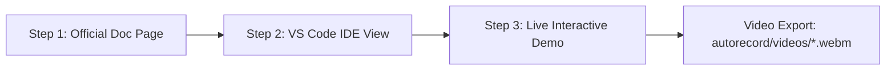

# CopilotKit + Agno Autorecording Suite 🎬

Automated, high-fidelity screen demonstration and video recording engine for the **CopilotKit + Agno (Python / AgentOS)** integration test harness.

---

## 📑 Table of Contents

- [Overview](#-overview)
- [3-Step Video Workflow](#-3-step-video-workflow)
- [Directory Structure](#-directory-structure)
- [Prerequisites & Getting Started](#-prerequisites--getting-started)
- [Usage & CLI Reference](#-usage--cli-reference)
- [Configured Pages & Route Mapping](#-configured-pages--route-mapping)
- [Architecture & Core Modules](#-architecture--core-modules)
  - [1. Standalone VS Code IDE Simulator](#1-standalone-vs-code-ide-simulator)
  - [2. Windows 11 Taskbar & Virtual Mouse Overlay](#2-windows-11-taskbar--virtual-mouse-overlay)
  - [3. Slide-up Notepad Developer Notes](#3-slide-up-notepad-developer-notes)
  - [4. Tailored Action Handlers](#4-tailored-action-handlers)
- [Output Videos](#-output-videos)
- [Troubleshooting & FAQ](#-troubleshooting--faq)

---

## 🌟 Overview

The **Autorecord Suite** is a Playwright-powered recording pipeline designed to produce professional, human-like demonstration videos for documentation features, generative UI components, human-in-the-loop flows, agent routing, and runtime error debugging.

### Key Highlights:
- **100% Pure VS Code Simulation**: Step 2 renders code directly via a standalone HTML/CSS generator—completely isolated from Next.js, eliminating dev badges, portals, or floating inspectors.
- **Natural Human Physics**: Virtual mouse cursor with cubic Bézier curves, Fitts's law acceleration, micro-overshoots, realistic typing jitter, and smooth document scrolling.
- **Tailored Interactions**: Automatically interacts with custom UI elements (e.g. clicking HITL buttons, toggling Dark Mode in agent state, switching prebuilt tabs, and inspecting live AG-UI SSE streams).
- **Export Standards**: Produces 1080p, 60fps WebM videos directly in `autorecord/videos/` with standardized naming (`AgnoReact-<FeatureName>.webm`).

---

## 🎬 3-Step Video Workflow

Every recorded video follows a consistent, high-production 3-step sequence:



1. **Step 1 — Official Documentation View**:
   - Opens the official CopilotKit Agno doc URL (`https://docs.copilotkit.ai/agno/...`).
   - Glides mouse to reading position, smoothly scrolls at human reading cadence, and hovers over the main code snippet.

2. **Step 2 — Visual Studio Code IDE View**:
   - Renders a standalone VS Code Dark+ interface (`vs-dark`) directly from project source files on disk.
   - Highlights the exact snippet lines (`startLine` to `endLine`) with `#264f78` background and `#007acc` accent border.
   - Smoothly glides the virtual cursor down across the highlighted lines.

3. **Step 3 — Live Interactive Demo**:
   - Navigates directly to the isolated demo endpoint (`http://localhost:3000/<route>/demo-chat`).
   - Injects the simulated Windows 11 Taskbar with live clock, start menu, and active app indicators.
   - Types test prompts with natural keystrokes and executes custom action handlers (e.g., clicking options, toggling state, waiting for streaming AI tokens or tool execution).

---

## 📂 Directory Structure

```
autorecord/
├── record-all-pages.ts        # CLI entrypoint & batch runner
├── README.md                  # Complete autorecord guide (this file)
├── package.json               # Node.js dependencies (Playwright, TSX)
├── videos/                    # Output directory for exported WebM videos
│   └── AgnoReact-Quickstart.webm
└── recorder/
    ├── README.md              # Recorder module architecture reference
    ├── types.ts               # TypeScript interfaces & configuration schemas
    ├── config.ts              # Page registry with 21 Agno routes, file paths & line numbers
    ├── engine.ts              # Playwright browser lifecycle manager & recording coordinator
    ├── ide/
    │   └── generator.ts       # Standalone pure HTML/CSS VS Code Dark+ simulator
    ├── overlays/
    │   ├── taskbar.ts         # Windows 11 Taskbar simulation overlay
    │   ├── cursor.ts          # Virtual mouse physics, Bézier easing & typing helpers
    │   └── notepad.ts         # Slide-up Notepad developer note simulator
    └── actions/
        ├── prebuilt.action.ts       # Tab switching: CopilotChat -> CopilotSidebar -> CopilotPopup
        ├── programmatic.action.ts   # Dark Mode state toggle & runAgent execution
        ├── slots.action.ts          # Slot customization: Level 1 -> Level 2 -> Level 3 tabs
        ├── headless-ui.action.ts    # Custom headless chat input & response observation
        ├── inspector.action.ts      # CopilotKit Inspector overlay toggle
        ├── hitl.action.ts           # Human-in-the-loop choice card button clicks
        ├── frontend-tools.action.ts # sayHello, setThemeColor, and addBookmark UI triggers
        ├── runtime.action.ts        # Multi-agent routing: default vs agno_agent
        ├── ag-ui.action.ts          # Live AG-UI SSE protocol event log showcase
        ├── threads.action.ts        # Drawer, headless list, and lifecycle minting/pinning
        ├── display-only.action.ts   # WeatherCard generative UI rendering
        ├── tool-rendering.action.ts # Named get_weather card + wildcard fallback
        ├── error-debugging.action.ts# Live error capture panel showcase
        ├── partial-notes.action.ts  # Notepad developer notes for reference/stub pages
        └── index.ts                 # Action dispatcher with standard chat fallback
```

---

## ⚡ Prerequisites & Getting Started

### 1. Start the Agno Backend (AgentOS)
```bash
cd backend
uv run main.py
```
*Backend runs on `http://localhost:8000` exposing the AG-UI SSE endpoint at `/api/copilotkit`.*

### 2. Start the Next.js Frontend
```bash
cd frontend
npm run dev
```
*Frontend runs on `http://localhost:3000`.*

### 3. Install Autorecord Dependencies (First Time Only)
```bash
cd autorecord
npm install
npx playwright install chromium
```

---

## 🚀 Usage & CLI Reference

### Record an Individual Feature Page
Pass the `--page=<id>` flag to record any specific route:

```bash
# Quickstart demo
npx tsx autorecord/record-all-pages.ts --page=quickstart

# Generative UI - Weather Card
npx tsx autorecord/record-all-pages.ts --page=display-only

# Human in the Loop (offerOptions choice selection)
npx tsx autorecord/record-all-pages.ts --page=human-in-the-loop

# Custom Look and Feel - Programmatic Control (State toggles)
npx tsx autorecord/record-all-pages.ts --page=programmatic-control

# Frontend Tools (theme, greetings, bookmarks)
npx tsx autorecord/record-all-pages.ts --page=frontend-tools
```

### Record All Pages Sequentially
Run the script without arguments to record all 21 configured pages in batch mode:

```bash
npx tsx autorecord/record-all-pages.ts
```

---

## 📋 Configured Pages & Route Mapping

All 21 routes in `frontend/src/lib/nav-config.ts` are mapped with accurate source files and line ranges:

| Page ID | Video Output Filename | Route URL | Target Source File | Highlighted Lines |
|---|---|---|---|---|
| `quickstart` | `AgnoReact-Quickstart.webm` | `/quickstart/demo-chat` | `frontend/src/app/quickstart/demo-chat/page.tsx` | 18–24 |
| `prebuilt-components` | `AgnoReact-PrebuiltComponents.webm` | `/prebuilt-components/demo-chat` | `frontend/src/app/prebuilt-components/demo-chat/page.tsx` | 59–94 |
| `threads-overview` | `AgnoReact-ThreadsOverview.webm` | `/threads` | `frontend/src/app/threads/page.tsx` | 26–67 |
| `threads-drawer` | `AgnoReact-ThreadsDrawer.webm` | `/threads/drawer/demo-chat` | `frontend/src/app/threads/drawer/demo-chat/page.tsx` | 25–33 |
| `threads-headless` | `AgnoReact-ThreadsHeadless.webm` | `/threads/headless/demo-chat` | `frontend/src/app/threads/headless/demo-chat/page.tsx` | 24–36 |
| `threads-lifecycle` | `AgnoReact-ThreadsLifecycle.webm` | `/threads/lifecycle/demo-chat` | `frontend/src/app/threads/lifecycle/demo-chat/page.tsx` | 41–68 |
| `threads-import` | `AgnoReact-ThreadsImport.webm` | `/threads/import` | `frontend/src/app/threads/import/page.tsx` | 36–43 |
| `threads-architecture` | `AgnoReact-ThreadsArchitecture.webm` | `/threads/architecture` | `frontend/src/app/threads/architecture/page.tsx` | 42–79 |
| `programmatic-control` | `AgnoReact-ProgrammaticControl.webm` | `/custom-look-and-feel/programmatic-control/demo-chat` | `frontend/src/app/custom-look-and-feel/programmatic-control/demo-chat/page.tsx` | 72–85 |
| `inspector` | `AgnoReact-Inspector.webm` | `/custom-look-and-feel/inspector/demo-chat` | `frontend/src/app/custom-look-and-feel/inspector/demo-chat/page.tsx` | 18–30 |
| `slots` | `AgnoReact-Slots.webm` | `/custom-look-and-feel/slots/demo-chat` | `frontend/src/app/custom-look-and-feel/slots/demo-chat/page.tsx` | 67–112 |
| `headless-ui` | `AgnoReact-HeadlessUI.webm` | `/custom-look-and-feel/headless-ui/demo-chat` | `frontend/src/app/custom-look-and-feel/headless-ui/demo-chat/page.tsx` | 19–33 |
| `display-only` | `AgnoReact-DisplayOnly.webm` | `/generative-ui/your-components/display-only/demo-chat` | `frontend/src/app/generative-ui/your-components/display-only/demo-chat/page.tsx` | 50–58 |
| `interactive` | `AgnoReact-Interactive.webm` | `/generative-ui/your-components/interactive` | `frontend/src/app/generative-ui/your-components/interactive/page.tsx` | 1–17 |
| `tool-rendering` | `AgnoReact-ToolRendering.webm` | `/generative-ui/tool-rendering/demo-chat` | `frontend/src/app/generative-ui/tool-rendering/demo-chat/page.tsx` | 50–80 |
| `frontend-tools` | `AgnoReact-FrontendTools.webm` | `/frontend-tools/demo-chat` | `frontend/src/app/frontend-tools/demo-chat/page.tsx` | 25–96 |
| `human-in-the-loop` | `AgnoReact-HumanInTheLoop.webm` | `/human-in-the-loop/demo-chat` | `frontend/src/components/global-frontend-tools.tsx` | 74–114 |
| `copilot-runtime` | `AgnoReact-CopilotRuntime.webm` | `/backend/copilot-runtime/demo-chat` | `frontend/src/app/backend/copilot-runtime/demo-chat/page.tsx` | 16–52 |
| `ag-ui` | `AgnoReact-AgUi.webm` | `/backend/ag-ui/demo-chat` | `frontend/src/app/backend/ag-ui/demo-chat/page.tsx` | 70–100 |
| `error-debugging` | `AgnoReact-ErrorDebugging.webm` | `/troubleshooting/error-debugging/demo-chat` | `frontend/src/app/troubleshooting/error-debugging/demo-chat/page.tsx` | 16–72 |

---

## 🛠️ Architecture & Core Modules

### 1. Standalone VS Code IDE Simulator
- **Location**: [`autorecord/recorder/ide/generator.ts`](file:///c:/Users/dynamic%20computer/Desktop/work/FIQROS/optimized-malaika/agno/autorecord/recorder/ide/generator.ts)
- **Design Principle**: Generates an isolated HTML/CSS page from the repository's files on disk and renders it with `page.setContent()`.
- **Advantages**:
  - Zero Next.js / React hydration overhead.
  - Zero risk of Next.js dev indicators, dev overlays, or CopilotKit Inspector icons appearing.
  - Pixel-perfect reproduction of VS Code Dark+ (tabs, Explorer, breadcrumbs, line numbers, line highlight).

### 2. Windows 11 Taskbar & Virtual Mouse Overlay
- **Location**: [`autorecord/recorder/overlays/taskbar.ts`](file:///c:/Users/dynamic%20computer/Desktop/work/FIQROS/optimized-malaika/agno/autorecord/recorder/overlays/taskbar.ts), [`autorecord/recorder/overlays/cursor.ts`](file:///c:/Users/dynamic%20computer/Desktop/work/FIQROS/optimized-malaika/agno/autorecord/recorder/overlays/cursor.ts)
- Injects a simulated Windows 11 Taskbar with live clock, system tray, and active app glow indicators.
- Emulates authentic mouse physics:
  - Quadratic/Cubic Bézier trajectory interpolation.
  - Fitts's law deceleration near target elements.
  - Jitter and micro-overshoot corrections.
  - Visual click ripple indicators.

### 3. Slide-up Notepad Developer Notes
- **Location**: [`autorecord/recorder/overlays/notepad.ts`](file:///c:/Users/dynamic%20computer/Desktop/work/FIQROS/optimized-malaika/agno/autorecord/recorder/overlays/notepad.ts)
- For architectural, conceptual, or stub pages (`threads-overview`, `threads-architecture`, `threads-import`, `interactive`), slides up a Windows 11 Notepad modal and types developer notes character by character with realistic typing cadence.

### 4. Tailored Action Handlers
- **Location**: [`autorecord/recorder/actions/`](file:///c:/Users/dynamic%20computer/Desktop/work/FIQROS/optimized-malaika/agno/autorecord/recorder/actions/)
- Handlers specialize in unique page requirements:
  - `hitl.action.ts`: Waits for the `offerOptions` choice component in the chat stream, moves cursor over Option 1, and clicks it.
  - `programmatic.action.ts`: Clicks "Dark Mode" to update `agent.state`, writes a draft message, and triggers `runAgent`.
  - `slots.action.ts`: Cycles through Level 1 (Tailwind), Level 2 (Props override), and Level 3 (Custom components).
  - `runtime.action.ts`: Tests `default` agent routing then switches to `agno_agent`.
  - `ag-ui.action.ts`: Sends a query and hovers over the live SSE event log (RunStarted, TextMessageContent, ToolCall, RunFinished).

---

## 🎥 Output Videos

All recorded videos are saved directly to:
```
autorecord/videos/
```

- Resolution: **1920 × 1080 (1080p Full HD)**
- Framerate: **60 FPS**
- Format: **WebM** (`VP8` / `VP9` codec)
- Naming: `AgnoReact-<FeatureName>.webm`

---

## ❓ Troubleshooting & FAQ

### 1. `TimeoutError: page.goto: Timeout 60000ms exceeded`
- **Cause**: The Next.js frontend (`localhost:3000`) or Python backend (`localhost:8000`) is not running.
- **Fix**: Verify both servers are running in separate terminal windows before starting recordings.

### 2. AI response does not finish streaming before video ends
- **Fix**: Increase `waitAfterPromptMs` in [`autorecord/recorder/config.ts`](file:///c:/Users/dynamic%20computer/Desktop/work/FIQROS/optimized-malaika/agno/autorecord/recorder/config.ts) for that specific page config (e.g. set `waitAfterPromptMs: 12000`).

### 3. Browser window closes unexpectedly
- **Fix**: Check `autorecord/recorder/engine.ts` console output for specific Playwright selector errors. Ensure the prompt or button text matches the current UI labels.
