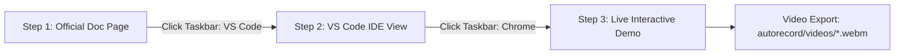

# CopilotKit + Agno Autorecording Suite 🎬

Automated, high-fidelity screen demonstration and video recording engine for the **CopilotKit + Agno (Python / AgentOS)** integration test harness.

---

## 📑 Table of Contents

- [Overview](#-overview)
- [3-Step Video Workflow](#-3-step-video-workflow)
- [Interactive Taskbar App-Switching](#-interactive-taskbar-app-switching)
- [Next.js Error Overlay Auto-Expansion & Diagnostics](#-nextjs-error-overlay-auto-expansion--diagnostics)
- [Directory Structure](#-directory-structure)
- [Prerequisites & Getting Started](#-prerequisites--getting-started)
- [Usage & CLI Reference](#-usage--cli-reference)
- [Configured Pages & Route Mapping](#-configured-pages--route-mapping)
- [Porting to Other Projects (Agno / LangGraph / SDKs)](PORTING_GUIDE.md)
- [Architecture & Core Modules](#-architecture--core-modules)
  - [1. Standalone VS Code IDE Simulator](#1-standalone-vs-code-ide-simulator)
  - [2. Windows 11 Taskbar & App Switching Overlay](#2-windows-11-taskbar--app-switching-overlay)
  - [3. Next.js Error Recognition & Modal Expander](#3-nextjs-error-recognition--modal-expander)
  - [4. Slide-up Notepad Developer Notes](#4-slide-up-notepad-developer-notes)
  - [5. Tailored Action Handlers](#5-tailored-action-handlers)
- [Output Videos & Filename Conventions](#-output-videos--filename-conventions)
- [Troubleshooting & Diagnostics](#-troubleshooting--diagnostics)

---

## 🌟 Overview

The **Autorecord Suite** is a Playwright-powered recording pipeline designed to produce professional, human-like demonstration videos for documentation features, generative UI components, human-in-the-loop flows, agent routing, and runtime error debugging.

### Key Highlights:

- **Zero Black Screen & Instant Paint**: Starts immediately on the rendered doc page using `domcontentloaded` without dead delay frames.
- **Interactive App-Switching Realism**: Glides the cursor to click Windows 11 Taskbar icons (illuminating active blue glow bars) between Doc, IDE, and Demo steps.
- **100% Pure VS Code Simulation**: Step 2 renders code directly via a standalone HTML/CSS generator—completely isolated from Next.js, eliminating dev badges or floating inspectors.
- **Elevated Next.js Dev Badge**: The Next.js dev indicator is automatically positioned at `bottom: 56px` to sit cleanly 8px above the Windows 11 Taskbar in full view.
- **Automated Next.js Error Recognition & Overlay Window**: When an error occurs (stream drop, API 404/500, or component exception), the engine pauses 2.5s, glides to the Next.js dev icon on the bottom-left, clicks it, turns the badge red, expands the full **Next.js 15 Error Overlay Window** (with error title, origin endpoint, and call stack), and captures it for 4.5s.
- **Pre-flight Service Diagnostics**: Verifies that both Next.js (`http://localhost:3000`) and Agno AgentOS (`http://localhost:8000`) are online before starting.
- **Natural Human Physics**: Virtual mouse cursor with cubic Bézier curves, Fitts's law acceleration, micro-overshoots, realistic typing jitter, and smooth document scrolling.

---

## 🎬 3-Step Video Workflow

Every recorded video follows a consistent, high-production 3-step sequence:



1. **Step 1 — Official Documentation View**:
   - Opens the official CopilotKit Agno doc URL (`https://docs.copilotkit.ai/agno/...`).
   - Glides mouse to reading position, smoothly scrolls down at human reading cadence, and hovers over the code snippet.
   - Glides cursor down to the simulated Windows 11 Taskbar, clicks the **VS Code** icon, and illuminates the blue active glow bar (`#60a5fa`).

2. **Step 2 — Visual Studio Code IDE View**:
   - Renders a standalone VS Code Dark+ interface (`vs-dark`) directly from project source files on disk.
   - Highlights the exact snippet lines (`startLine` to `endLine`) with `#264f78` background and `#007acc` accent border.
   - Smoothly glides the virtual cursor down across the highlighted lines.
   - Glides cursor down to the Taskbar and clicks the **Chrome** icon (illuminating its blue glow bar).

3. **Step 3 — Live Interactive Demo**:
   - Navigates directly to the isolated demo endpoint (`http://localhost:3000/<route>/demo-chat`).
   - Injects the simulated Windows 11 Taskbar with live clock, start menu, and active app indicators.
   - Types test prompts with natural keystrokes and executes custom action handlers (e.g., clicking options, toggling state, waiting for streaming AI tokens or tool execution).
   - Monitors for runtime errors and auto-expands the authentic Next.js error overlay window if an error occurs.

---

## 🖥️ Interactive Taskbar App-Switching

Rather than abrupt URL jumps, transitions between steps simulate natural desktop multitasking:

- **Switching from Doc $\rightarrow$ VS Code**: The virtual mouse glides down to `#win11-taskbar-vscode`, hovers with a translucent highlight (`rgba(255,255,255,0.08)`), clicks the icon, illuminates the blue active glow bar underneath VS Code, and transitions to the IDE.
- **Switching from VS Code $\rightarrow$ Live Demo**: The cursor glides down to `#win11-taskbar-chrome`, clicks the Chrome icon, illuminates the blue active glow bar underneath Chrome, and transitions to the live demo.

---

## 🚨 Next.js Error Overlay Auto-Expansion & Diagnostics

When an error occurs during Step 3 (runtime failure, compilation issue, or CopilotKit stream disconnect):

1. **Error Detection**: The engine catches the error via browser console listeners, network failure intercepts, or CopilotKit stream events.
2. **2.5-Second Visual Pause**: Deliberately pauses for 2.5s so the video viewer clearly sees the error state in the chat.
3. **Cursor Glide to Next.js Icon**: The virtual mouse glides directly to the exact live pixel center of the Next.js dev badge on the bottom left (`x: 79, y: 1006`).
4. **Click & Expand Next.js Error Window**: Clicks the icon, turns the Next.js badge red (`#ca2a30`), and expands the **Next.js 15 Error Overlay Window**:
   - 🔴 **Red Header Badge**: `Runtime Error` + Current Route Path
   - 📝 **Error Title**: Full error message
   - 🌐 **Origin Endpoint**: Full route URL
   - 💻 **Diagnostic Call Stack**: Stack trace detailing `@copilotkit/core`, `@ag-ui/client`, and source files
   - 🔗 **Documentation Link**: Footer link to CopilotKit + Agno error docs
5. **4.5-Second Stack Trace Capture**: Holds the error modal on screen for 4.5s so the complete diagnostic trace is recorded in the video.
6. **Filename Tagging**: Saves the video as `AgnoReact-<Page>_[ERROR].webm` and reports `❌ [FAIL]` in the suite summary table.

---

## 📂 Directory Structure

```
autorecord/
├── record-all-pages.ts        # CLI entrypoint & batch runner with summary report
├── README.md                  # Comprehensive root guide (this file)
├── package.json               # Node.js dependencies (Playwright, TSX)
├── videos/                    # Output directory for exported WebM videos
│   ├── AgnoReact-Quickstart.webm
│   └── AgnoReact-Quickstart_[ERROR].webm
└── recorder/
    ├── README.md              # Recorder module architecture reference
    ├── types.ts               # TypeScript interfaces & configuration schemas
    ├── config.ts              # Page registry with 21 Agno routes, file paths & line numbers
    ├── engine.ts              # Playwright browser lifecycle manager & recording coordinator
    ├── diagnostics.ts         # Pre-flight service health checks & error pattern matcher
    ├── ide/
    │   └── generator.ts       # Standalone pure HTML/CSS VS Code Dark+ simulator
    ├── overlays/
    │   ├── taskbar.ts         # Windows 11 Taskbar simulation overlay & app switching
    │   ├── cursor.ts          # Virtual mouse physics, Bézier easing & typing helpers
    │   ├── nextjs-error.ts    # Next.js error badge detection, click & modal expander
    │   └── notepad.ts         # Slide-up Notepad developer note simulator
    └── actions/
        ├── prebuilt.action.ts       # Tab switching: CopilotChat -> CopilotSidebar -> CopilotPopup
        ├── programmatic.action.ts   # Dark Mode state toggle & runAgent execution
        ├── slots.action.ts          # Slot customization: Level 1 -> Level 2 -> Level 3 tabs
        ├── headless-ui.action.ts    # Custom headless chat input & response observation
        ├── inspector.action.ts      # CopilotKit Inspector overlay toggle
        ├── hitl.action.ts           # Human-in-the-loop choice card button clicks
        ├── frontend-tools.action.ts # sayHello, setThemeColor, and addBookmark UI triggers
        ├── runtime.action.ts        # Multi-agent routing: default vs agno_agent
        ├── ag-ui.action.ts          # Live AG-UI SSE protocol event log showcase
        ├── threads.action.ts        # Drawer, headless list, and lifecycle minting/pinning
        ├── display-only.action.ts   # WeatherCard generative UI rendering
        ├── tool-rendering.action.ts # Named get_weather card + wildcard fallback
        ├── error-debugging.action.ts# Live error capture panel showcase
        ├── partial-notes.action.ts  # Notepad developer notes for reference/stub pages
        └── index.ts                 # Action dispatcher with standard chat fallback
```

---

## ⚡ Prerequisites & Getting Started

### 1. Start the Agno Backend (AgentOS)

```bash
cd backend
uv run main.py
```

_Backend runs on `http://localhost:8000` exposing the AG-UI SSE endpoint at `/api/copilotkit`._

### 2. Start the Next.js Frontend

```bash
cd frontend
npm run dev
```

_Frontend runs on `http://localhost:3000`._

### 3. Install Autorecord Dependencies (First Time Only)

```bash
cd autorecord
npm install
npx playwright install chromium
```

---

## 🚀 Usage & CLI Reference

### Record an Individual Feature Page

Pass the `--page=<id>` flag to record any specific route.

```bash
# 1. Quickstart demo
npm run record -- --page=quickstart
# 2. Prebuilt Components
npm run record -- --page=prebuilt-components
# 3. Rich Threads - Overview
npm run record -- --page=threads-overview
# 4. Rich Threads - Threads Drawer
npm run record -- --page=threads-drawer
# 5. Rich Threads - Headless Threads
npm run record -- --page=threads-headless

# 6. Rich Threads - Thread & History Lifecycle
npm run record -- --page=threads-lifecycle

# 7. Rich Threads - Synchronize Thread History
npm run record -- --page=threads-import

# 8. Rich Threads - Persistence Architecture
npm run record -- --page=threads-architecture
# 9. Custom Look and Feel - Programmatic Control
npm run record -- --page=programmatic-control
# 10. Custom Look and Feel - Inspector
npm run record -- --page=inspector
# 11. Custom Look and Feel - Slots
npm run record -- --page=slots
# 12. Custom Look and Feel - Headless UI
npm run record -- --page=headless-ui
# 13. Generative UI - Display Only Component
npm run record -- --page=display-only
# 14. Generative UI - Interactive (Stub)
npm run record -- --page=interactive
# 15. Generative UI - Tool Rendering
npm run record -- --page=tool-rendering
# 16. App Control - Frontend Tools
npm run record -- --page=frontend-tools
# 17. App Control - Human in the Loops
npm run record -- --page=human-in-the-loop
# 18. Backend - Copilot Runtime
npm run record -- --page=copilot-runtime
# 19. Backend - AG-UI Protocol Stream
npm run record -- --page=ag-ui
# 20. Troubleshooting - Error Debugging & Observability
npm run record -- --page=error-debugging
```

### Record All Pages Sequentially

Run without arguments to record all 21 configured pages in batch mode:

```bash
npm run record
```

### Batch Summary Table Example:

```
======================================================
📊 RECORDING SUITE SUMMARY
======================================================
   ✅ [PASS] Quickstart -> AgnoReact-Quickstart.webm
   ✅ [PASS] Human In The Loop -> AgnoReact-HumanInTheLoop.webm
   ❌ [FAIL] Error Debugging -> AgnoReact-ErrorDebugging_[ERROR].webm (Next.js Error Overlay expanded)
======================================================
📁 Video files saved to: autorecord/videos
```

---

## 📋 Configured Pages & Route Mapping

All 21 routes in `frontend/src/lib/nav-config.ts` are mapped with accurate source files and line ranges:

| Page ID                | Video Output Filename                | Route URL                                               | Target Source File                                                               | Highlighted Lines |
| ---------------------- | ------------------------------------ | ------------------------------------------------------- | -------------------------------------------------------------------------------- | ----------------- |
| `quickstart`           | `AgnoReact-Quickstart.webm`          | `/quickstart/demo-chat`                                 | `frontend/src/app/quickstart/demo-chat/page.tsx`                                 | 18–24             |
| `prebuilt-components`  | `AgnoReact-PrebuiltComponents.webm`  | `/prebuilt-components/demo-chat`                        | `frontend/src/app/prebuilt-components/demo-chat/page.tsx`                        | 59–94             |
| `threads-overview`     | `AgnoReact-ThreadsOverview.webm`     | `/threads`                                              | `frontend/src/app/threads/page.tsx`                                              | 26–67             |
| `threads-drawer`       | `AgnoReact-ThreadsDrawer.webm`       | `/threads/drawer/demo-chat`                             | `frontend/src/app/threads/drawer/demo-chat/page.tsx`                             | 25–33             |
| `threads-headless`     | `AgnoReact-ThreadsHeadless.webm`     | `/threads/headless/demo-chat`                           | `frontend/src/app/threads/headless/demo-chat/page.tsx`                           | 24–36             |
| `threads-lifecycle`    | `AgnoReact-ThreadsLifecycle.webm`    | `/threads/lifecycle/demo-chat`                          | `frontend/src/app/threads/lifecycle/demo-chat/page.tsx`                          | 41–68             |
| `threads-import`       | `AgnoReact-ThreadsImport.webm`       | `/threads/import`                                       | `frontend/src/app/threads/import/page.tsx`                                       | 36–43             |
| `threads-architecture` | `AgnoReact-ThreadsArchitecture.webm` | `/threads/architecture`                                 | `frontend/src/app/threads/architecture/page.tsx`                                 | 42–79             |
| `programmatic-control` | `AgnoReact-ProgrammaticControl.webm` | `/custom-look-and-feel/programmatic-control/demo-chat`  | `frontend/src/app/custom-look-and-feel/programmatic-control/demo-chat/page.tsx`  | 72–85             |
| `inspector`            | `AgnoReact-Inspector.webm`           | `/custom-look-and-feel/inspector/demo-chat`             | `frontend/src/app/custom-look-and-feel/inspector/demo-chat/page.tsx`             | 18–30             |
| `slots`                | `AgnoReact-Slots.webm`               | `/custom-look-and-feel/slots/demo-chat`                 | `frontend/src/app/custom-look-and-feel/slots/demo-chat/page.tsx`                 | 67–112            |
| `headless-ui`          | `AgnoReact-HeadlessUI.webm`          | `/custom-look-and-feel/headless-ui/demo-chat`           | `frontend/src/app/custom-look-and-feel/headless-ui/demo-chat/page.tsx`           | 19–33             |
| `display-only`         | `AgnoReact-DisplayOnly.webm`         | `/generative-ui/your-components/display-only/demo-chat` | `frontend/src/app/generative-ui/your-components/display-only/demo-chat/page.tsx` | 50–58             |
| `interactive`          | `AgnoReact-Interactive.webm`         | `/generative-ui/your-components/interactive`            | `frontend/src/app/generative-ui/your-components/interactive/page.tsx`            | 1–17              |
| `tool-rendering`       | `AgnoReact-ToolRendering.webm`       | `/generative-ui/tool-rendering/demo-chat`               | `frontend/src/app/generative-ui/tool-rendering/demo-chat/page.tsx`               | 50–80             |
| `frontend-tools`       | `AgnoReact-FrontendTools.webm`       | `/frontend-tools/demo-chat`                             | `frontend/src/app/frontend-tools/demo-chat/page.tsx`                             | 25–96             |
| `human-in-the-loop`    | `AgnoReact-HumanInTheLoop.webm`      | `/human-in-the-loop/demo-chat`                          | `frontend/src/components/global-frontend-tools.tsx`                              | 74–114            |
| `copilot-runtime`      | `AgnoReact-CopilotRuntime.webm`      | `/backend/copilot-runtime/demo-chat`                    | `frontend/src/app/backend/copilot-runtime/demo-chat/page.tsx`                    | 16–52             |
| `ag-ui`                | `AgnoReact-AgUi.webm`                | `/backend/ag-ui/demo-chat`                              | `frontend/src/app/backend/ag-ui/demo-chat/page.tsx`                              | 70–100            |
| `error-debugging`      | `AgnoReact-ErrorDebugging.webm`      | `/troubleshooting/error-debugging/demo-chat`            | `frontend/src/app/troubleshooting/error-debugging/demo-chat/page.tsx`            | 16–72             |

---

## 🛠️ Architecture & Core Modules

### 1. Standalone VS Code IDE Simulator

- **Location**: [`autorecord/recorder/ide/generator.ts`](file:///c:/Users/dynamic%20computer/Desktop/work/FIQROS/optimized-malaika/agno/autorecord/recorder/ide/generator.ts)
- Generates an isolated HTML/CSS page from local project files and renders it with `page.setContent()`.
- Completely decouples the IDE view from Next.js, guaranteeing zero dev badges or floating inspectors on Step 2.

### 2. Windows 11 Taskbar & App Switching Overlay

- **Location**: [`autorecord/recorder/overlays/taskbar.ts`](file:///c:/Users/dynamic%20computer/Desktop/work/FIQROS/optimized-malaika/agno/autorecord/recorder/overlays/taskbar.ts)
- Injects the simulated Windows 11 Taskbar and coordinates animated icon clicks (`clickTaskbarApp`) to transition between Step 1 (Doc) $\rightarrow$ Step 2 (VS Code) $\rightarrow$ Step 3 (Chrome).
- Automatically elevates the Next.js dev portal above the 48px taskbar.

### 3. Next.js Error Recognition & Modal Expander

- **Location**: [`autorecord/recorder/overlays/nextjs-error.ts`](file:///c:/Users/dynamic%20computer/Desktop/work/FIQROS/optimized-malaika/agno/autorecord/recorder/overlays/nextjs-error.ts), [`autorecord/recorder/diagnostics.ts`](file:///c:/Users/dynamic%20computer/Desktop/work/FIQROS/optimized-malaika/agno/autorecord/recorder/diagnostics.ts)
- Automatically spots errors, pauses 2.5s, glides the mouse cursor directly to the Next.js dev badge on the bottom left (`x: 79, y: 1006`), clicks it to expand the authentic Next.js 15 Error Overlay Window, and holds for 4.5s.

### 4. Slide-up Notepad Developer Notes

- **Location**: [`autorecord/recorder/overlays/notepad.ts`](file:///c:/Users/dynamic%20computer/Desktop/work/FIQROS/optimized-malaika/agno/autorecord/recorder/overlays/notepad.ts)
- For architectural or reference stub pages (`threads-overview`, `threads-architecture`, `threads-import`, `interactive`), slides up a Windows 11 Notepad modal and types developer notes with natural keystroke timing.

### 5. Tailored Action Handlers

- **Location**: [`autorecord/recorder/actions/`](file:///c:/Users/dynamic%20computer/Desktop/work/FIQROS/optimized-malaika/agno/autorecord/recorder/actions/)
- Handlers specialize in unique page interactions:
  - `hitl.action.ts`: Waits for `offerOptions` choice buttons in the stream, glides cursor over Option 1, and clicks it.
  - `programmatic.action.ts`: Clicks "Dark Mode" to update `agent.state`, writes a draft message, and triggers `runAgent`.
  - `slots.action.ts`: Cycles through Level 1 (Tailwind), Level 2 (Props override), and Level 3 (Custom components).
  - `runtime.action.ts`: Tests `default` agent routing then switches to `agno_agent`.
  - `ag-ui.action.ts`: Sends a query and hovers over live SSE event logs (`RunStarted`, `TextMessageContent`, `ToolCall`, `RunFinished`).

---

## 🎥 Output Videos & Filename Conventions

All recorded videos are saved to:

```
autorecord/videos/
```

- Resolution: **1920 × 1080 (1080p Full HD)**
- Framerate: **60 FPS**
- Format: **WebM** (`VP8` / `VP9` codec)
- **Successful / Clean Runs**: `AgnoReact-<FeatureName>.webm`
- **Error Captured Runs**: `AgnoReact-<FeatureName>_[ERROR].webm`

---

## ❓ Troubleshooting & Diagnostics

### 1. `Pre-flight Service Diagnostics: Agno Backend is unreachable`

- **Cause**: The Python FastAPI AgentOS server on port 8000 is not running.
- **Fix**: Run `cd backend && uv run main.py`.

### 2. `Pre-flight Service Diagnostics: Next.js Frontend is unreachable`

- **Cause**: The Next.js dev server on port 3000 is not running.
- **Fix**: Run `cd frontend && npm run dev`.

### 3. AI response streaming takes longer than default timeout

- **Fix**: Increase `waitAfterPromptMs` in [`autorecord/recorder/config.ts`](file:///c:/Users/dynamic%20computer/Desktop/work/FIQROS/optimized-malaika/agno/autorecord/recorder/config.ts) for that page (e.g. `waitAfterPromptMs: 12000`).
