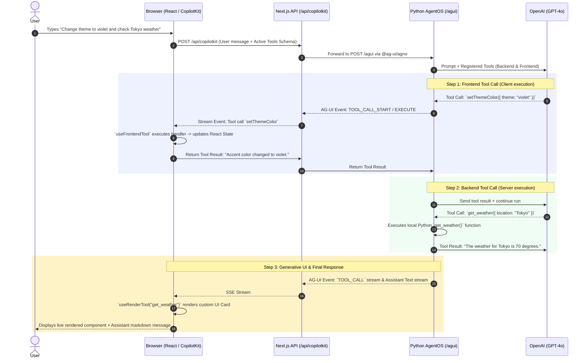

# CopilotKit + Agno Architecture & Integration Guide

A concise, diagram-driven reference explaining how **CopilotKit (Frontend & Runtime)** and **Agno (Python Backend)** communicate and function together in this project.

---

## 1. High-Level System Architecture

```
+---------------------------------------------------------------------------------------------+
|                                      FRONTEND (Next.js 16)                                  |
|                                                                                             |
|   +-------------------------------------------------------------------------------------+   |
|   |  Browser Client                                                                     |   |
|   |                                                                                     |   |
|   |  • <CopilotKitProvider runtimeUrl="/api/copilotkit">                                |   |
|   |  • UI Surfaces: <CopilotChat />, <CopilotSidebar />, Custom UI                     |   |
|   |  • Hooks: useFrontendTool, useHumanInTheLoop, useRenderTool                        |   |
|   +------------------------------------------+------------------------------------------+   |
|                                              | HTTP POST (SSE Stream)                       |
|                                              v                                              |
|   +-------------------------------------------------------------------------------------+   |
|   |  Next.js API Route (/api/copilotkit/[[...slug]]/route.ts)                           |   |
|   |                                                                                     |   |
|   |  • CopilotRuntime + createCopilotRuntimeHandler (@copilotkit/runtime/v2)            |   |
|   |  • @ag-ui/agno Adapter -> connects to AGNO_AGENT_URL (http://localhost:8000/agui)   |   |
|   +------------------------------------------+------------------------------------------+   |
+----------------------------------------------|----------------------------------------------+
                                               | AG-UI Protocol (HTTP / SSE)
                                               v
+---------------------------------------------------------------------------------------------+
|                                    BACKEND (Python 3.12 + FastAPI)                          |
|                                                                                             |
|   • AgentOS server running on port 8000 (main.py)                                           |
|   • AGUI Interface mounted at POST /agui                                                    |
|   • Agno Agent (agent.py) configured with:                                                  |
|       - Model: OpenAI (gpt-4o)                                                              |
|       - Backend Tools: get_weather (local Python execution)                                 |
|       - Frontend Tools: sayHello, setThemeColor, offerOptions (external_execution=True)     |
+---------------------------------------------------------------------------------------------+
```

---

## 2. End-to-End Request & Event Lifecycle



---

## 3. Frontend Architecture (`/frontend`)

The frontend is a **Next.js 16 (App Router)** application built with TypeScript and Tailwind CSS.

### Key File Breakdown

| File Path | Role & Purpose |
| :--- | :--- |
| [`src/app/layout.tsx`](file:///c:/Users/dynamic%20computer/Desktop/work/FIQROS/optimized-malaika/agno/frontend/src/app/layout.tsx) | Root layout; imports `@copilotkit/react-core/v2/styles.css` and wraps entire app in `Providers`. |
| [`src/components/providers.tsx`](file:///c:/Users/dynamic%20computer/Desktop/work/FIQROS/optimized-malaika/agno/frontend/src/components/providers.tsx) | Configures `<CopilotKitProvider runtimeUrl="/api/copilotkit">`, dev console inspector, and error logging. |
| [`src/app/api/copilotkit/[[...slug]]/route.ts`](file:///c:/Users/dynamic%20computer/Desktop/work/FIQROS/optimized-malaika/agno/frontend/src/app/api/copilotkit/[[...slug]]/route.ts) | Server-side runtime bridge converting Next.js requests to Agno AG-UI backend calls via `AgnoAgent`. |
| [`src/components/global-frontend-tools.tsx`](file:///c:/Users/dynamic%20computer/Desktop/work/FIQROS/optimized-malaika/agno/frontend/src/components/global-frontend-tools.tsx) | Mounts browser-side tools (`sayHello`, `setThemeColor`, `addBookmark`, `offerOptions`). |
| [`src/components/harness-state.tsx`](file:///c:/Users/dynamic%20computer/Desktop/work/FIQROS/optimized-malaika/agno/frontend/src/components/harness-state.tsx) | Client React state (accent color, bookmarks, notifications, error logs). |

### Core Frontend Hooks & Primitives

```
+------------------------------------------------------------------------------------+
|                             COPILOTKIT V2 FRONTEND HOOKS                           |
+------------------------------------------------------------------------------------+
|  useFrontendTool(...)                                                              |
|  -> Runs JavaScript code directly in the user's browser when triggered by the agent|
|  -> e.g., mutate DOM, trigger modals, update React state, navigate routes          |
+------------------------------------------------------------------------------------+
|  useHumanInTheLoop(...)                                                            |
|  -> Pauses the agent execution run until the user interacts with custom UI buttons |
|  -> Calls `respond(value)` to unblock the agent with user choice                   |
+------------------------------------------------------------------------------------+
|  useRenderTool(...) / useDefaultRenderTool(...)                                    |
|  -> Replaces raw tool call JSON with custom React UI components during streaming   |
+------------------------------------------------------------------------------------+
|  <CopilotChat /> / <CopilotSidebar /> / <CopilotPopup />                           |
|  -> Ready-made UI components for agent interaction and thread history              |
+------------------------------------------------------------------------------------+
```

---

## 4. Backend Architecture (`/backend`)

The backend is built with **Agno (Agent framework)** and **FastAPI** using `AgentOS`.

### Key File Breakdown

| File Path | Role & Purpose |
| :--- | :--- |
| [`backend/main.py`](file:///c:/Users/dynamic%20computer/Desktop/work/FIQROS/optimized-malaika/agno/backend/main.py) | Entrypoint; creates `AgentOS` with `AGUI(agent=agent)` interface mounted at `/agui` on port `8000`. |
| [`backend/agent.py`](file:///c:/Users/dynamic%20computer/Desktop/work/FIQROS/optimized-malaika/agno/backend/agent.py) | Instantiates `Agent(model=OpenAIChat(...), tools=ALL_TOOLS, instructions=...)`. |
| [`backend/tools/backend_tools.py`](file:///c:/Users/dynamic%20computer/Desktop/work/FIQROS/optimized-malaika/agno/backend/tools/backend_tools.py) | Server-executed Python functions (e.g. `get_weather`). |
| [`backend/tools/frontend_tools.py`](file:///c:/Users/dynamic%20computer/Desktop/work/FIQROS/optimized-malaika/agno/backend/tools/frontend_tools.py) | Declarations with `@tool(external_execution=True)` and empty bodies for client execution. |

---

## 5. Tool Execution Comparison

```
                      +-----------------------------+
                      |       LLM Selects Tool      |
                      +--------------+--------------+
                                     |
             +-----------------------+-----------------------+
             |                                               |
             v                                               |
  [ Backend Tool ]                                           v
 (external_execution=False)                         [ Frontend Tool / HITL ]
             |                                     (external_execution=True)
             v                                               |
  Executed by Python Process                                 v
  (e.g., Database, APIs, Python math)             Emits AG-UI Event to Next.js
             |                                               |
             v                                               v
  Result fed directly to LLM                      Browser runs JS Handler or UI
                                                             |
                                                             v
                                                  Result sent back to Backend
```

| Dimension | Backend Tools | Frontend Tools | Human-in-the-Loop (HITL) |
| :--- | :--- | :--- | :--- |
| **Decorator** | `@tool` | `@tool(external_execution=True)` | `@tool(external_execution=True)` |
| **Python Body** | Real Python code | Empty `pass` / docstring | Empty `pass` / docstring |
| **Execution Location** | Python Backend (Server) | Client Browser (React) | Client Browser (User Click) |
| **React Hook** | `useRenderTool` *(optional UI)* | `useFrontendTool` | `useHumanInTheLoop` |
| **Primary Use Cases** | DB queries, API calls, server tasks | UI themes, localStorage, navigation | Approvals, confirmations, options |
| **Naming Rule** | `snake_case` (Python standard) | `camelCase` (exact name match) | `camelCase` (exact name match) |

---

## 6. Communication Flow Summary

1. **User interaction**: User speaks or types in `<CopilotChat />` on Next.js frontend (`localhost:3000`).
2. **Proxy Request**: Next.js route `/api/copilotkit` forwards stream to Python Agno server (`localhost:8000/agui`).
3. **Agno Agent**: AgentOS evaluates prompt with OpenAI model and system instructions.
4. **Tool Negotiation**:
   - If **server tool**: executed in Python, result returned to model.
   - If **client tool**: paused in Python, event streamed to browser, browser executes JS handler, returns result to resume backend run.
5. **Streaming Output**: Final markdown stream + Generative UI components rendered real-time in React.
